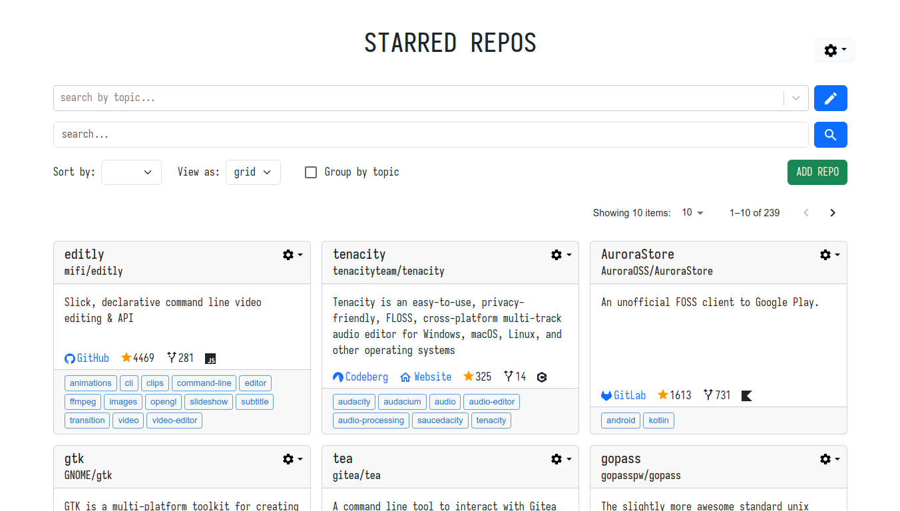
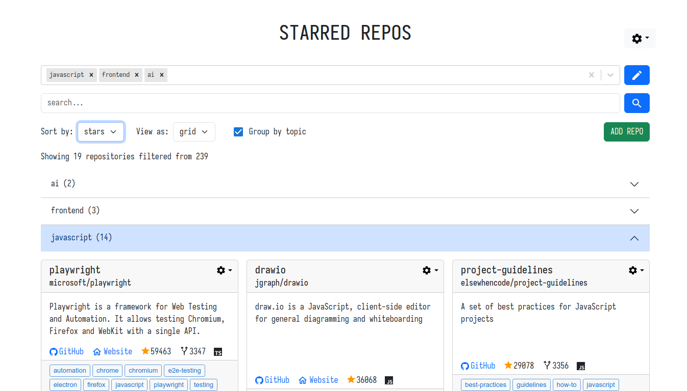
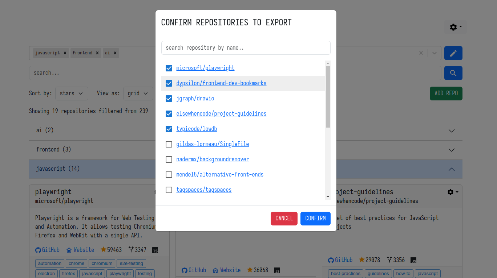
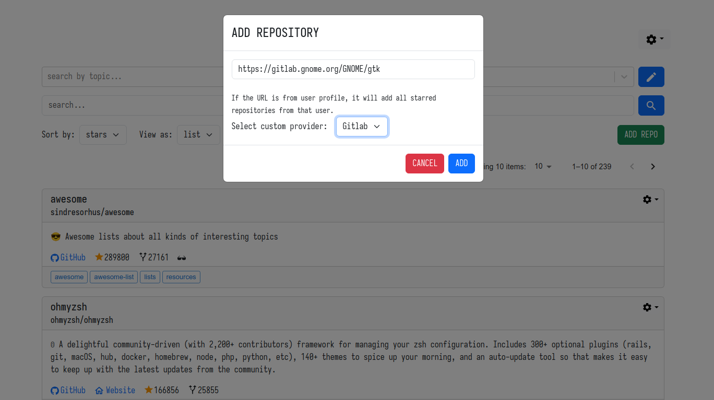

# STARRED REPOS ORGANIZER

Organizer your starred repositories from various sources.

Table Of Contents:

- [Demo](#demo)
- [Features](#features)
- [Usage](#usage)
- [Development](#development)
- [Roadmap](#roadmap)
- [Credits](#credits)
- [License](#license)

## Demo

A live demo is available at <https://uwla.github.io/starred_repos_organizer>.






## Features

- Star repositories from GitHub, GitLab, Codeberg, self-hosted Gitlab instance,
  self-hosted Gitea instance (more coming soon)
- No account needed, save starred repositories locally
- Import starred repositories from any public user profile on Github or Gitlab
- Import repositories from JSON file
- Export repositories to JSON file
- Export filtered results only to JSON file
- Modify repository topics by adding new ones or deleting existing
- More privacy by not exposing your interests to the internet
- Works offline (except when adding repositories, because it fetches remote data)
- Can be downloaded as single HTML file to run locally
- Sort by name, stars or forks
- Text search and topic filter
- Display items in list
- Display items in grid
- Pagination view
- Group-by-topics view
- Dark & Light themes
- Persistent user preferences

## Usage

There are few options (easiest is the first one):

1. Go to the [demo page](https://uwla.github.io/starred_repos_organizer) to use the app.
2. Download `app.html`from the [latest release](https://github.com/uwla/starred_repos_organizer/releases/tag/v0.0.1-beta).
3. Download `app.html` from the demo page.
4. Follow developemnt instructions to launch a local server or build the app locally.

## Development

1. Clone the repo and `cd` into it:

    ```bash
    git clone https://github.com/uwla/starred_repos_organizer && cd starred_repos_organizer
    cd starred_repos_organizer
    ```

2. Install dependencies:

    ```bash
    npm install
    ```

3. Copy the local sample file `user-data-sample.json` to `user-data.json`:

    ```bash
    cp user-data-sample.json user-data.json
    ```

    This is where the data will be stored.

4. Run the scripts:

    To start development server using localStorage for storage:

    ```bash
    npm run dev
    ```

    To start development server using an REST server for storage:

    ```bash
    npm run dev:rest
    ```

    To build the demo app:

    ```bash
    npm run build
    ```

## Roadmap

- [x] Search filter
- [x] Topics filter
- [x] Sort repos by name or stars
- [x] Import all starred repos from public profiles
- [x] Manual selection when importing repos in batch
- [x] Display forks, code language, and other details
- [x] Import data from file
- [x] Export data to file
- [x] Export only filtered entries
- [x] Option to delete all repos
- [x] Option to delete filtered repos
- [x] Show notifications on success
- [x] Manage topics globally
- [x] Display items in list
- [x] Display items in grid
- [x] Group items by topic
- [x] Support for GitHub
- [x] Support for GitLab
- [x] Support for CodeBerg
- [x] Support for self-hosted GitLab instance
- [x] Support for self-hosted Gitea instance
- [ ] Support for self-hosted Gogs instance
- [x] Option to specify provider type
- [ ] Option to set auth tokens

## Credits

Thanks [Keziah Moselle](https://github.com/KeziahMoselle) for the
inspiration from his project [export-github-stars](https://github.com/KeziahMoselle/export-github-stars), which export GitHub starred repositories to a JSON file.

## License

MIT.
